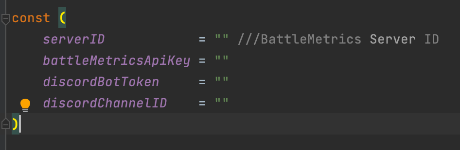
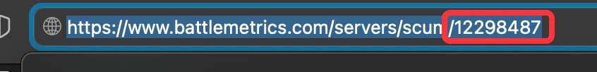

## Getting Started

### Installing

This assumes you already have a working Go environment, if not please see [this page](https://golang.org/doc/install) first.

To run the program you will need to add the following keys 

> serverID            = "The letter and digit at the end of the url of the server in BattleMetric"

> battleMetricsApiKey = "Create a battle metric account and visit [this url](https://www.battlemetrics.com/developers/token) to get the key. you will need to select the permissions and create a token"

> discordBotToken     = "Go to the discord developer portal here, and create a new app. in the app go to bot and reset token and copy token."

> discordChannelID    = "To get the discordChannel ID is simple you need to go in developer mode and write click on the channel you want the id from. to learn how to go into developer mode learn [here](https://www.partitionwizard.com/partitionmagic/discord-developer-mode.html)"

Once you have save all the following keys. you will need to add your bot to your channel by going to 0auth2 and URL Generator.
Select bot and any permission that has to do with writing messages and editing them. 

Once you get the URL visit it in a other tab and add the bot to your server.

Note the app most be running at all time for it to continually work.
To the the app go to the directory with your terminal of the main.go file and run the command 
> go run main.go

THank you create an issue if something is not working I will try my best to help out.